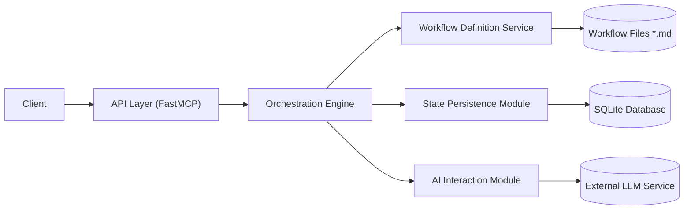

# Workflow Orchestrator MCP Server

This project implements an AI-Powered Workflow Orchestrator as an MCP (Model Context Protocol) server. It is designed to manage and execute complex, dynamic workflows by leveraging a Large Language Model (LLM) for intelligent decision-making and adaptability.

## Core Concepts

The orchestrator breaks down complex tasks into manageable, discrete steps defined within workflows. An AI agent (LLM) determines the sequence of these steps dynamically based on:

*   The workflow definition (written in Markdown).
*   The current task context (state variables).
*   Real-time feedback provided by the client executing the steps.

Key concepts include:

*   **AI-Driven Decisions:** Enables dynamic branching, error handling, and adaptation based on step outcomes and context.
*   **Markdown Definitions:** Workflows and steps are defined in human-readable Markdown files.
*   **Persistent State:** Workflow state is stored in a local SQLite database, allowing for long-running processes.
*   **Workflow Resumption:** Interrupted workflows can be resumed, with the AI helping reconcile the client's state with the persisted state.

## Features

*   **Intelligent, Non-Linear Workflows:** Moves beyond rigid scripts to adaptable processes.
*   **Reusable & Modular Steps:** Step definitions in Markdown promote reuse and maintainability.
*   **Human-Readable & Editable:** Easy to author and understand workflows.
*   **Adaptable Instructions & AI Prompts:** Dynamically generated prompts provide rich context to the AI.
*   **Persistent State Management:** Reliable tracking of workflow progress using SQLite.
*   **Resumption Capability:** Recover and continue interrupted workflows seamlessly.

## Architecture

The system uses a modular architecture:



*   **API Layer (FastMCP Server):** Handles MCP tool requests.
*   **Orchestration Engine:** Core logic coordinating workflow execution.
*   **Workflow Definition Service:** Loads, parses, and validates Markdown workflow definitions.
*   **State Persistence Module:** Manages workflow state and history in the SQLite database (`workflow_state.db`).
*   **AI Interaction Module:** Communicates with the external LLM service.

(See [`docs/architecture_and_data_model.md#2-high-level-architecture`](docs/architecture_and_data_model.md#2-high-level-architecture) for full details).

## Workflows

Workflows are defined in subdirectories within the `WORKFLOW_DEFINITIONS_DIR` directory specified in the MCP server settings. Each workflow has:

*   `index.md`: Defines the overall goal and lists the steps.
*   `steps/`: A directory containing individual Markdown files for each step, including `# Orchestrator Guidance` and `# Client Instructions`.

**Available Workflows:**

*   JOKE_GENERATOR
*   README_FRESHNESS_CHECK
*   REFACTOR_WITH_TESTS
*   RESUME
*   SAVE
*   WORKFLOW_CREATOR

(See [`docs/architecture_and_data_model.md#8-workflow-definition-service-details`](docs/architecture_and_data_model.md#8-workflow-definition-service-details) for more on the definition format).

## MCP Tools

This server provides the following MCP tools:

*   **`list_workflows`**: List available workflow definitions.
*   **`start_workflow`**: Starts a workflow by name, optionally with initial context.
    *   Input: `{ "workflow_name": "string", "context": {} }`
*   **`get_workflow_status`**: Gets the current status of a running workflow instance.
    *   Input: `{ "instance_id": "string" }`
*   **`advance_workflow`**: Reports the outcome of the previous step and requests the next step.
    *   Input: `{ "instance_id": "string", "report": { "step_id": "string", "result": any, "status": "string", ... }, "context_updates": {} }`
*   **`resume_workflow`**: Reconnects to an existing workflow instance, providing the client's assumed state for reconciliation.
    *   Input: `{ "instance_id": "string", "assumed_current_step_name": "string", "report": { ... }, "context_updates": {} }`

(Refer to the MCP server definition or [`docs/architecture_and_data_model.md#7-api-specification`](docs/architecture_and_data_model.md#7-api-specification) for detailed input/output schemas, noting the mapping from HTTP API to MCP tools).

## Configuration

The server is configured via environment variables. Paths can be specified as relative to the current working directory or as absolute paths:

*   `WORKFLOW_DEFINITIONS_DIR` (Required): Path to the workflow definitions directory (e.g., `./workflows` or `/home/user/projects/orchestrator-mcp-server/workflows`).
*   `WORKFLOW_DB_PATH` (Required): Path to the SQLite database file (e.g., `./data/workflows.sqlite` or `/home/user/projects/orchestrator-mcp-server/data/workflows.sqlite`).
*   `GEMINI_MODEL_NAME` (Required, unless `USE_STUB_AI_CLIENT` is `true`): The name of the Gemini model to use (e.g., `gemini-2.5-flash-latest`).
*   `USE_STUB_AI_CLIENT` (Optional): Set to `true` to use a stubbed AI client for testing, bypassing the need for AI service configuration (default: `false`).
*   `LOG_LEVEL` (Optional): Logging level (default: `info`).
*   `AI_SERVICE_ENDPOINT` (Optional): URL for the LLM service API (only used if not using the stub client).
*   `AI_SERVICE_API_KEY` (Optional): API key for the LLM service (only used if not using the stub client).
*   `AI_REQUEST_TIMEOUT_MS` (Optional): Timeout for AI requests in milliseconds (default: `30000`).

## Quickstart / Running the Server

1.  **Prerequisites:**
    *   Python environment managed by `uv`.
    *   Required environment variables set (see Configuration).
    *   Ensure directories for `WORKFLOW_DEFINITIONS_DIR` and `WORKFLOW_DB_PATH` exist and are writable.
2.  **Install Dependencies:**
    ```bash
    uv sync
    ```
3.  **Run the Server:**
    ```bash
    uv run python -m orchestrator_mcp_server
    ```
    Alternatively, if you have installed the server using `pipx install .`, you can run the `orchestrator-mcp-server` command directly. By default, the server uses relative paths (`./workflows` and `./data/workflows.sqlite`) for workflow definitions and the database. To use these default paths, you must run the `orchestrator-mcp-server` command from the project's root directory (`/home/jean/git/orchestrator-mcp-server`). If you set the `WORKFLOW_DEFINITIONS_DIR` and `WORKFLOW_DB_PATH` environment variables to absolute paths (see Configuration), you can run the `orchestrator-mcp-server` command from any directory.

### Running with Cline

To run the orchestrator as an MCP server within Cline, add the following configuration to the `mcpServers` content of your `cline_mcp_settings.json` file:

```json
"orchestrator-mcp-server": {
      "autoApprove": [],
      "disabled": false,
      "timeout": 60,
      "command": "orchestrator-mcp-server",
      "env": {
        "WORKFLOW_DEFINITIONS_DIR": "/home/YOUR_USERNAME/git/orchestrator-mcp-server/workflows",
        "WORKFLOW_DB_PATH": "/home/YOUR_USERNAME/git/orchestrator-mcp-server/workflow_state.db",
        "GEMINI_MODEL_NAME": "gemini-2.5-flash-preview-04-17",
        "GEMINI_API_KEY": "YOUR__API_KEY"
      },
      "transportType": "stdio"
    }
```

Remember to replace `"YOUR_USERNAME"` with your actual username and `"YOUR_ANONYMIZED_API_KEY"` with your actual Gemini API key and adjust the paths if your project is located elsewhere.

## Development Status

**Next Steps:**

*   Implement comprehensive integration tests to verify the system's behavior under various conditions.
*   Continue refining error handling and edge cases.
*   Expand documentation with usage examples and best practices.
*   Develop additional workflow templates for common use cases.

## Testing

The primary testing strategy involves integration tests exercising the API and core components, using a **stubbed AI Interaction Module** to provide deterministic responses. A dedicated test database is used. Unit tests cover specific utility functions and parsing logic.

(See [`docs/architecture_and_data_model.md#12-testing-strategy`](docs/architecture_and_data_model.md#12-testing-strategy) for details).
