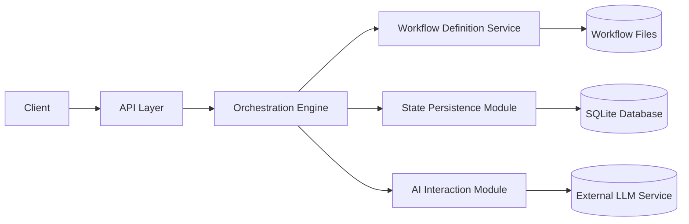
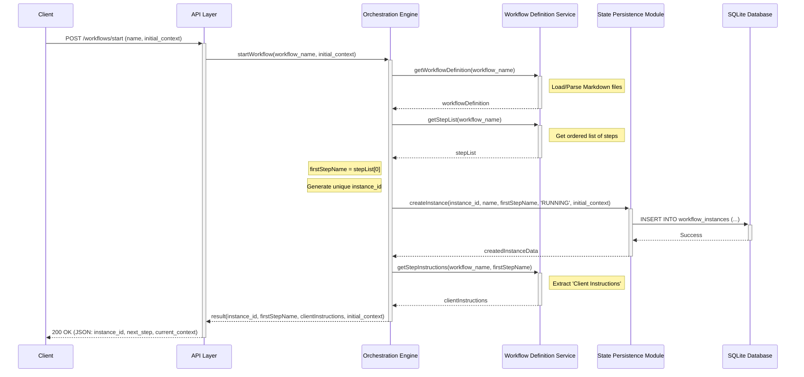
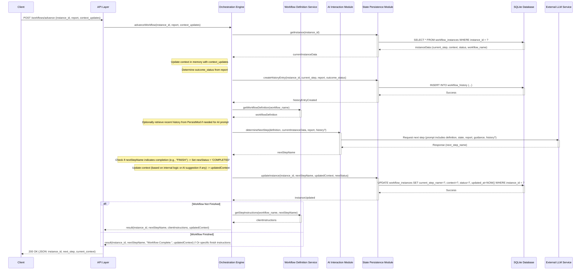
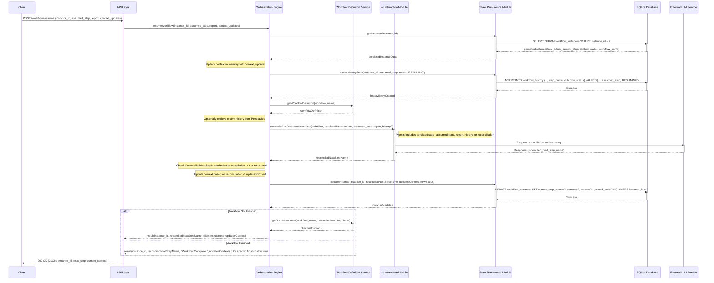

# Workflow Orchestrator - Architecture and Data Model

**Version:** 1.7
**Date:** 2025-04-20
**Status:** Draft

## Revision History

*   v1.0 (2025-04-20): Initial Draft (Architecture, Data Model)
*   v1.1 (2025-04-20): Added Sequence Diagram for Start Workflow interaction.
*   v1.2 (2025-04-20): Added Sequence Diagram for Advance Workflow interaction.
*   v1.3 (2025-04-20): Corrected Mermaid syntax in Advance Workflow sequence diagram using explicit activation/deactivation.
*   v1.4 (2025-04-20): Further revised Mermaid syntax in Advance Workflow sequence diagram, using return arrows for final deactivations to avoid parser errors.
*   v1.5 (2025-04-20): Added Sequence Diagram for Resume Workflow interaction.
*   v1.6 (2025-04-20): Added Section 5 detailing AI Interaction Design (Prompts and JSON Response Format).
*   v1.7 (2025-04-20): Restored missing sequence diagrams in Section 4.

---

# 1. Overview
This document outlines the high-level architecture, the detailed data model, key interaction sequences, and AI interaction design for the Workflow Orchestrator system. It consolidates design decisions made based on the initial Product Specification Document (PSD) and subsequent discussions.

The system aims to orchestrate dynamic workflows using an AI agent, managing state persistently and allowing for workflow resumption.

# 2. High-Level Architecture
The system is designed with a modular approach, separating concerns into distinct components.

## 2.1. Components
API Layer (e.g., Web API Controller/Handler):

Responsibility: Receives incoming HTTP requests (e.g., /workflows/start), validates format, parses JSON, routes requests to the Orchestration Engine, and formats/sends responses.

Workflow Orchestration Engine (Core Logic):

Responsibility: Coordinates workflow execution. Manages interactions between other components to load definitions, handle state, interact with the AI, and determine the next steps based on user reports and workflow logic. Handles state reconciliation during resume.

Workflow Definition Service (/Parser):

Responsibility: Loads and parses workflow definitions from the filesystem (Markdown files). Provides definitions and step details (including client instructions) to the Orchestration Engine. Handles workflow discovery.

State Persistence Module (Repository/Adapter):

Responsibility: Manages all CRUD (Create, Read, Update, Delete) operations for workflow instance state against the chosen persistent storage (SQLite). Abstracts database details from the Orchestration Engine. Also responsible for creating history entries.

AI Interaction Module (AI Client/Adapter):

Responsibility: Handles communication with the external AI/LLM service. Formats prompts using workflow definitions, state, and user reports. Sends requests to the AI and parses responses (next step determination, including reconciliation).

## 2.2. Component Interaction Diagram


# 3. Data Model
Based on the requirements for persistent state (FR-06) and the need to store interaction history for improved AI context, the following data model was chosen.

## 3.1. Storage Technology
Choice: SQLite

Rationale: Meets the requirement for a simple, local persistence solution. Stores the entire database in a single file, requires minimal setup, is robust, and provides good support for JSON data within text fields.

## 3.2. Data Structure Approach
Choice: Two separate tables: one for current instance state (workflow_instances) and one for historical events (workflow_history).

Rationale: This is a standard relational approach that keeps the current state record lean and allows for efficient querying of historical steps. It leverages SQLite's relational capabilities effectively.

## 3.3. SQLite Schema
Table: workflow_instances

Stores the current state of each workflow instance.

```sql
CREATE TABLE workflow_instances (
    instance_id TEXT PRIMARY KEY,         -- Unique identifier (e.g., UUID)
    workflow_name TEXT NOT NULL,          -- Name of the workflow definition being used
    current_step_name TEXT NOT NULL,      -- The name of the last step determined by the orchestrator
    status TEXT NOT NULL CHECK(status IN ('RUNNING', 'SUSPENDED', 'COMPLETED', 'FAILED')), -- Current status
    context TEXT,                         -- Workflow context stored as JSON text
    created_at DATETIME NOT NULL DEFAULT CURRENT_TIMESTAMP, -- Instance creation time
    updated_at DATETIME NOT NULL,         -- Last modification time (requires trigger)
    completed_at DATETIME DEFAULT NULL    -- Instance completion/failure time (nullable)
);

-- Trigger to automatically update 'updated_at' timestamp on modification
CREATE TRIGGER trigger_workflow_instances_updated_at
AFTER UPDATE ON workflow_instances
FOR EACH ROW
BEGIN
    UPDATE workflow_instances SET updated_at = CURRENT_TIMESTAMP WHERE instance_id = OLD.instance_id;
END;

/* Optional Indexes:
CREATE INDEX idx_workflow_instances_status ON workflow_instances (status);
CREATE INDEX idx_workflow_instances_workflow_name ON workflow_instances (workflow_name);
*/
```

Table: workflow_history

Stores the sequence of steps and interactions for each instance.

```sql
CREATE TABLE workflow_history (
    history_entry_id INTEGER PRIMARY KEY AUTOINCREMENT, -- Auto-incrementing ID for the history entry
    instance_id TEXT NOT NULL,                       -- Links to workflow_instances table
    timestamp DATETIME NOT NULL DEFAULT CURRENT_TIMESTAMP, -- Time of this history event
    step_name TEXT NOT NULL,                         -- The step being reported on / just finished OR 'RESUME_ATTEMPT'
    user_report TEXT,                                -- User's report for this step/resume (as JSON text)
    outcome_status TEXT,                             -- Status derived from report ('success', 'failure', etc.) OR 'RESUMING'
    determined_next_step TEXT,                       -- The next step decided by the orchestrator after this event
    FOREIGN KEY (instance_id) REFERENCES workflow_instances (instance_id) ON DELETE CASCADE -- Link to parent instance
);

-- Index for efficiently retrieving history for a specific instance
CREATE INDEX idx_workflow_history_instance_id ON workflow_history (instance_id);
```

## 3.4. Data Handling Notes
The context field in workflow_instances and the user_report field in workflow_history are stored as TEXT. Application code is responsible for JSON serialization before writing and deserialization after reading.

The updated_at field in workflow_instances relies on a trigger for automatic updates in SQLite.

The FOREIGN KEY constraint with ON DELETE CASCADE ensures data integrity by removing history entries if the parent workflow instance is deleted.

The workflow_history table can also record resume attempts.

While the database schema enforces the status field constraint via a CHECK constraint, the WorkflowInstance model in the application code defines the field as a string without explicit validation. The database constraint serves as the ultimate validator for this field.


# 4. Sequence Diagrams
This section illustrates the interactions between components for key API operations.

## 4.1. Start Workflow (POST /workflows/start)
This diagram shows the sequence of calls when a client initiates a new workflow instance.



Notes:

Error handling paths are omitted for clarity.

The Orchestration Engine is responsible for generating the unique instance_id.

The initial context provided by the client is stored persistently.

No entry is added to workflow_history during the start operation itself; history entries are typically added during advance or resume calls, recording the outcome of a step.

## 4.2. Advance Workflow (POST /workflows/advance)
This diagram shows the sequence when a client reports the outcome of a step and requests the next one. (Mixed activation mode).



Notes:

Error handling omitted.

The engine first retrieves the current state, then records the outcome of the previous step in the history.

The engine then calls the AI, potentially providing recent history along with the definition, current state, and user report.

After getting the next step from the AI, the engine updates the instance's state (current_step_name, context, status) in the database.

Finally, it retrieves the client instructions for the new step (unless the workflow is finished) and returns the result.

## 4.3. Resume Workflow (POST /workflows/resume)
This diagram shows the sequence when a client reconnects to an existing workflow, potentially with a different state than the server expects.



Notes:

Error handling omitted.

The engine retrieves the server's persisted state.

A history entry is created to log the resume attempt, including the step the user thought they were on (assumed_step).

The crucial call to the AI includes both the persisted state and the user's assumed state/report for reconciliation.

The rest of the flow (updating state, getting instructions, returning response) mirrors the advance_workflow process, using the reconciledNextStepName determined by the AI.

# 5. AI Interaction Design (Prompts & Response Format)
This section details the strategy for interacting with the external LLM via the AI Interaction Module. The current implementation uses Google's Generative AI (Gemini) through the `GoogleGenAIClient` class in `ai_client.py`. Additionally, a `StubbedAIClient` is provided for testing purposes.

## 5.1. General Principles
- Structured Output: The LLM will be invoked using a mode that enforces JSON output to ensure reliable parsing of its responses.

- Clear Role & Goal: Prompts will clearly define the LLM's role as a workflow orchestrator assistant whose goal is to determine the next logical step based on the provided definition, state, history, and user input.

- Context is Key: Prompts must include all relevant information: the full workflow definition (or relevant parts), current instance state (step, context), user report, recent history (especially for advance and resume), and the user's assumed state (for resume).

- Guidance Utilization: Prompts will emphasize that the LLM should pay close attention to the **Orchestrator Guidance:** sections within the workflow step definitions.

## 5.2. Expected JSON Response Format
The AI Interaction Module expects the LLM to return a single JSON object matching the following structure. The LLM prompt will include instructions to adhere strictly to this format.

```json
{
  "next_step_name": "string",
  "updated_context": [
    {
      "key": "key1",
      "value": "value1"
    },
    {
      "key": "key2",
      "value": "value2"
    }
  ],
  "status_suggestion": "string | null",
  "reasoning": "string | null"
}
```

next_step_name (Required): The name of the next step the orchestrator should transition to. This must match a step name defined in the workflow's index.md or be a special value like "FINISH".

updated_context (Required, can be empty []): An array of objects, where each object has a "key" and a "value" property. These key-value pairs will be merged into the existing workflow instance context. The AI can use this to update state based on the user's report or workflow logic. If no changes are needed, it should return an empty array []. The AI Interaction Module will process this array format and convert it back to a dictionary before updating the workflow context.

status_suggestion (Optional): The AI can suggest a change to the overall workflow instance status (e.g., "FAILED", "COMPLETED", "SUSPENDED"). The Orchestration Engine may use this suggestion but makes the final decision. Defaults to null if no suggestion.

reasoning (Optional): A brief explanation from the LLM on why it chose the next_step_name, useful for logging and debugging. Defaults to null.

## 5.3. Prompt Design Strategy
Prompts will be constructed dynamically by the AI Interaction Module based on the specific operation (start, advance, resume). They will generally follow this structure:

System Prompt / Role Definition:

- Define the LLM's role (Workflow Orchestrator Assistant).

- State the primary goal (determine the next logical step).

- Emphasize adherence to the JSON output format defined below.

- Instruct it to use the provided Orchestrator Guidance within steps.

Workflow Definition:

- Provide the complete text content of the workflow definition (concatenated index.md and all steps/*.md files, clearly delimited by `\n\n---\n\n`). This gives the LLM the full process structure and guidance rules. Note that a `## Step: [Step Name]` header is automatically generated and prepended to each step's content in this blob, where `[Step Name]` is the canonical step ID from `index.md`.

Current State & History:

- For advance / resume: Provide the current persisted state (workflow_name, current_step_name, status, context JSON).

- For resume: Also provide the assumed_current_step_name provided by the user.

- Provide recent relevant entries from the workflow_history table (e.g., last 3-5 entries) to give context on recent interactions. Format this clearly (e.g., as a JSON array).

User Input / Report:

- Provide the user_report JSON submitted by the client for the advance or resume call.

Task Instruction:

- Clearly state the specific task:

  - start_workflow: "Determine the very first step for this workflow."

  - advance_workflow: "Based on the current state, the user's report for the last step ('{current_step_name}'), and the workflow definition (especially Orchestrator Guidance), determine the next logical step."

  - resume_workflow: "The user is resuming workflow instance '{instance_id}'. Their report indicates their current situation, and they believe they were on step '{assumed_current_step_name}'. The persisted server state shows the last known step was '{persisted_current_step_name}'. Reconcile the user's report and assumed state with the persisted state and history, using the workflow definition (especially Orchestrator Guidance), to determine the correct next logical step."

Output Format Reminder:

- Reiterate that the output MUST be a single JSON object matching the specified schema (repeat the schema structure).

## 5.4. Example Prompt Snippet (Conceptual - for advance_workflow)
```
SYSTEM: You are a Workflow Orchestrator Assistant. Your goal is to determine the next logical step in a workflow based on the provided definition, current state, user report, and history. You MUST pay close attention to the 'Orchestrator Guidance' within each step definition. Your output MUST be a single JSON object matching this schema:
{"next_step_name": "string", "updated_context": {}, "status_suggestion": "string | null", "reasoning": "string | null"}

WORKFLOW DEFINITION:
---
# Workflow: SPRINT_TASK
... (content of index.md) ...
---
# Step: Greet User
**Goal:** ...
**Orchestrator Guidance:** If user report indicates confusion, go to 'Explain Goal'. Otherwise, proceed to 'Gather Task Details'. Update context with user name if provided.
**Client Instructions:** ...
---
# Step: Gather Task Details
**Goal:** ...
**Orchestrator Guidance:** If report contains 'task_id', update context.task_id and proceed to 'Confirm Task'. If missing, go to 'Ask For Task ID'.
**Client Instructions:** ...
---
(rest of steps)
---

CURRENT STATE:
{
  "instance_id": "abc-123",
  "workflow_name": "SPRINT_TASK",
  "current_step_name": "Greet User",
  "status": "RUNNING",
  "context": {"user_name": "Alice"}
}

RECENT HISTORY:
[
  {"timestamp": "...", "step_name": "Start", "user_report": null, "outcome_status": "success", "determined_next_step": "Greet User"}
]

USER REPORT (for step 'Greet User'):
{
  "status": "success",
  "output": {"message": "Hi there!"},
  "error": null
}

TASK: Based on the current state, the user's report for the last step ('Greet User'), and the workflow definition (especially Orchestrator Guidance), determine the next logical step. Output ONLY the JSON object in the specified format.
```

This detailed prompt structure, combined with the enforced JSON output, should provide a robust mechanism for the AI Interaction Module to get reliable decisions from the LLM.


# 6. Error Handling Strategies
This section outlines how different error conditions should be handled by the system components. The goal is to ensure robustness, provide clear feedback to clients, and maintain consistent state where possible.

## 6.1. General Principles
- Logging: All significant errors MUST be logged with sufficient detail (timestamp, component, error message, relevant IDs like instance_id).
- API Responses: Errors surfaced to the client via the API should include a JSON error body. In the current implementation, error responses are simple JSON objects with an "error" field containing the error message (e.g., `{"error": "Failed to list workflows: [error details]"}`), rather than the structured format with error codes described in this document.
- Workflow Status: Critical errors during workflow execution (e.g., unrecoverable AI error, persistent DB error) SHOULD typically result in the workflow instance status being set to FAILED in the workflow_instances table.

## 6.2. API Layer Errors
- Invalid Request Format (e.g., non-JSON body):
    - Handling: Reject request immediately.
    - API Response: 400 Bad Request, {"error_code": "INVALID_FORMAT", "message": "Request body must be valid JSON."}
    - Logging: Log the occurrence.
- Missing Required Fields (e.g., missing instance_id in advance):
    - Handling: Perform validation before calling the Orchestration Engine.
    - API Response: 400 Bad Request, {"error_code": "MISSING_FIELD", "message": "Missing required field: [field_name]."}
    - Logging: Log the validation failure.
- Invalid Input Data Types (e.g., context_updates not an object):
    - Handling: Perform validation.
    - API Response: 400 Bad Request, {"error_code": "INVALID_TYPE", "message": "Invalid data type for field: [field_name]."}
    - Logging: Log the validation failure.
- (Future) Authentication/Authorization Errors:
    - Handling: Reject request based on auth checks.
    - API Response: 401 Unauthorized or 403 Forbidden.
    - Logging: Log the auth failure.

## 6.3. Orchestration Engine Errors
- Instance Not Found (from Persistence Module):
    - Handling: Catch InstanceNotFoundError (or equivalent) from State Persistence Module during advance or resume.
    - API Response: 404 Not Found, {"error_code": "INSTANCE_NOT_FOUND", "message": "Workflow instance with ID [instance_id] not found."}
    - Logging: Log the error with instance_id.
- Workflow Definition Not Found / Invalid (from Definition Service):
    - Handling: Catch DefinitionNotFoundError / DefinitionParsingError during start or when loading definition for advance/resume.
    - API Response (on start): 404 Not Found, {"error_code": "DEFINITION_NOT_FOUND", "message": "Workflow definition '[workflow_name]' not found or invalid."}
    - API Response (on advance/resume): 500 Internal Server Error, {"error_code": "DEFINITION_UNAVAILABLE", "message": "Workflow definition '[workflow_name]' could not be loaded."} (Internal error because instance exists but definition is broken).
    - Logging: Log the error with workflow_name.
    - State Change (on advance/resume): Set workflow_instances.status to FAILED.
- Error from AI Interaction Module:
    - Handling: Catch specific exceptions from AI Module (e.g., AIServiceTimeoutError, AIInvalidResponseError, AIServiceAPIError).
    - Retry Strategy: For potentially transient errors (AIServiceTimeoutError, maybe AIInvalidResponseError if parsing failed, certain 5xx AIServiceAPIErrors), attempt one retry immediately.
    - Failure: If retry fails or the error is non-retryable (e.g., 4xx API errors, content moderation), proceed to failure handling.
    - API Response (on failure): 502 Bad Gateway, {"error_code": "AI_SERVICE_ERROR", "message": "Failed to get decision from AI service after potential retry."}
    - Logging: Log detailed error from AI module, including whether a retry was attempted.
    - State Change (on failure): Set workflow_instances.status to FAILED. Update the workflow_history to record the failure context if possible.
- Error from State Persistence Module (e.g., during updateInstance or createHistoryEntry):
    - Handling: Catch PersistenceConnectionError or PersistenceQueryError. These indicate a critical failure in recording state.
    - API Response: 500 Internal Server Error, {"error_code": "PERSISTENCE_ERROR", "message": "Failed to save workflow state or history."}
    - Logging: Log detailed error from persistence module.
    - State Change: The state is likely inconsistent. The primary goal is to log the error accurately. Attempting to set status to FAILED might also fail. The system might need manual intervention or recovery logic depending on the persistence failure type. Do not proceed with returning potentially incorrect step instructions.

## 6.4. State Persistence Module Errors (SQLite)
- Connection Error:
    - Handling: Fail the operation (create, read, update).
    - Propagation: Throw specific exception (e.g., PersistenceConnectionError) to be caught by Orchestration Engine.
    - Logging: Log the connection failure.
- Query Error (e.g., SQL syntax, constraint violation):
    - Handling: Fail the operation.
    - Propagation: Throw specific exception (e.g., PersistenceQueryError) with details (SQL error code, message).
    - Logging: Log the failed query and error details.
- Record Not Found (on SELECT for getInstance):
    - Handling: Throw specific exception (e.g., InstanceNotFoundError).
    - Propagation: Propagate InstanceNotFoundError to Orchestration Engine.
    - Logging: Info level log (optional).

## 6.5. AI Interaction Module Errors
- AI Service Timeout:
    - Handling: Implement configurable timeout on the HTTP request to the LLM service.
    - Propagation: Throw specific exception (e.g., AIServiceTimeoutError).
    - Logging: Log the timeout event, including the configured timeout value.
- AI Service API Error (e.g., 4xx, 5xx response from LLM API):
    - Handling: Catch HTTP errors from the LLM client. Check status code.
    - Propagation: Throw specific exception (e.g., AIServiceAPIError) including HTTP status code and response body if available. Differentiate between potentially retryable (5xx) and non-retryable (4xx) errors if possible in the exception type or properties.
    - Logging: Log the API error details (URL, status code, response body).
- Invalid JSON Response (when expecting JSON):
    - Handling: Attempt to parse the LLM response as JSON. If fails:
    - Propagation: Throw specific exception (e.g., AIInvalidResponseError) including the raw response text.
    - Logging: Log the parsing failure and the raw response received.
- Content Moderation/Safety Errors:
    - Handling: Check response for specific safety flags or errors returned by the LLM API.
    - Propagation: Throw specific exception (e.g., AISafetyError).
    - Logging: Log the safety violation details.

## 6.6. Workflow Definition Service Errors
- Directory Not Found (workflows dir):
    - Handling: Fail at startup or when listing workflows.
    - Propagation: Log critical error, prevent server start or return 500 Internal Server Error on list_workflows.
    - Logging: Log the missing directory error.
- Workflow Subdirectory Not Found:
    - Handling: Return error when specific workflow is requested (start or loading for advance/resume).
    - Propagation: Throw DefinitionNotFoundError.
    - Logging: Log the missing workflow directory.
- index.md or Step File Not Found/Readable:
    - Handling: Treat definition as invalid when loading.
    - Propagation: Throw DefinitionNotFoundError or DefinitionParsingError.
    - Logging: Log the missing/unreadable file.
- Markdown Parsing Error (e.g., invalid format):
    - Handling: Treat definition as invalid when loading.
    - Propagation: Throw DefinitionParsingError with details (e.g., line number, file path).
    - Logging: Log the parsing error and file path.


# 7. API Specification
This section details the API interface provided by the Workflow Orchestrator. Rather than traditional HTTP endpoints, the implementation uses the MCP server framework, which defines tools that can be accessed through the MCP protocol. The conceptual API design described here is implemented as MCP tools in `server.py`.

## 7.1. Common Error Response Format
As defined in Section 6.1, all API errors (4xx, 5xx status codes) SHOULD return a JSON body with the following structure:

```json
{
  "error_code": "string",
  "message": "string"
}
```

*   `error_code`: A machine-readable code identifying the specific error (e.g., `INSTANCE_NOT_FOUND`, `INVALID_FIELD`, `AI_SERVICE_ERROR`). Refer to Section 6 for specific codes.
*   `message`: A human-readable description of the error.

## 7.2. GET /workflows/list
Description: Lists the names of all available workflow definitions discovered by the Workflow Definition Service.

*   **Method:** `GET`
*   **Path:** `/workflows/list`
*   **Request Body:** None

**Success Response:**

*   **Code:** `200 OK`
*   **Body Schema (JSON):**

```json
{
  "workflows": [
    "string"
  ]
}
```

*   **Example Body:**

```json
{
  "workflows": [
    "SPRINT_TASK",
    "USER_ONBOARDING"
  ]
}
```

**Error Responses:**

*   **Code:** `500 Internal Server Error`
    *   **Condition:** Error reading workflow directory (e.g., permissions, Definition Service failure).
    *   **Example Body:**
    ```json
    {"error_code": "DEFINITION_SERVICE_ERROR", "message": "Failed to retrieve workflow list."}
    ```

### 7.3. POST /workflows/start
Description: Initiates a new instance of a specified workflow.

*   **Method:** `POST`
*   **Path:** `/workflows/start`
*   **Request Body Schema (JSON):**

```json
{
  "workflow_name": "string",
  "context": {} // Optional, object
}
```

*   `workflow_name` (Required): The name of the workflow definition to start (must match a discovered workflow).
*   `context` (Optional): An initial key-value map (JSON object) to populate the workflow instance's context. Defaults to an empty object `{}` if omitted.

**Success Response:**

*   **Code:** `200 OK`
*   **Body Schema (JSON):**

```json
{
  "instance_id": "string",
  "next_step": {
    "step_name": "string",
    "instructions": "string"
  },
  "current_context": {} // object
}
```

*   `instance_id`: The unique ID generated for this new workflow instance.
*   `next_step`: An object containing details for the first step determined by the AI.
    *   `step_name`: The name of the initial step.
    *   `instructions`: The "Client Instructions" for the initial step.
*   `current_context`: The context object for the instance after initialization (will include the initial context provided in the request, if any).

**Error Responses:**

*   **Code:** `400 Bad Request`
    *   **Condition:** Invalid JSON format, missing required `workflow_name` field, `context` field is present but not a JSON object.
    *   **Example Body (Missing Field):**
    ```json
    {"error_code": "MISSING_FIELD", "message": "Missing required field: workflow_name."}
    ```
    *   **Example Body (Invalid Type):**
    ```json
    {"error_code": "INVALID_TYPE", "message": "Invalid data type for field: context."}
    ```
*   **Code:** `404 Not Found`
    *   **Condition:** The specified `workflow_name` does not correspond to a valid, loadable workflow definition.
    *   **Example Body:**
    ```json
    {"error_code": "DEFINITION_NOT_FOUND", "message": "Workflow definition 'INVALID_WORKFLOW_NAME' not found or invalid."}
    ```
*   **Code:** `500 Internal Server Error`
    *   **Condition:** Failed to save the initial instance state to the database (Persistence error), or an unexpected internal error occurred during processing.
    *   **Example Body (Persistence):**
    ```json
    {"error_code": "PERSISTENCE_ERROR", "message": "Failed to create workflow instance state."}
    ```
    *   **Example Body (Generic):**
    ```json
    {"error_code": "INTERNAL_ERROR", "message": "An unexpected error occurred while starting the workflow."}
    ```
*   **Code:** `502 Bad Gateway`
    *   **Condition:** Failure interacting with the AI service to determine the first step (after potential retries).
    *   **Example Body:**
    ```json
    {"error_code": "AI_SERVICE_ERROR", "message": "Failed to get initial step from AI service."}
    ```

### 7.4. POST /workflows/advance
Description: Reports the outcome of the previously issued step and requests the next step in the workflow.

*   **Method:** `POST`
*   **Path:** `/workflows/advance`
*   **Request Body Schema (JSON):**

```json
{
  "instance_id": "string",
  "report": {
    "status": "string", // e.g., "success", "failure", "in_progress", "clarification_provided"
    "details": {}, // Optional: object containing structured output or user feedback
    "message": "string", // Optional: Free-text description of actions, struggles, outcome
    "error": "string | null" // Optional: Error message if status is 'failure'
  },
  "context_updates": {} // Optional: object
}
```

*   `instance_id` (Required): The unique ID of the workflow instance to advance.
*   `report` (Required): An object detailing the outcome of the previous step.
    *   `status` (Required): Indicates the outcome (e.g., `success`, `failure`). Could also include statuses like `in_progress` if steps are long-running, or `clarification_provided` if answering a clarification step.
    *   `details` (Optional): A JSON object for structured data collected or generated during the step (e.g., form data, IDs).
    *   `message` (Optional): A free-text field where the client/user can describe actions taken, difficulties encountered, or provide qualitative feedback (valuable for history/knowledge base).
    *   `error` (Optional): A description of the error if status is `failure`. Defaults to `null`.
*   `context_updates` (Optional): A key-value map (JSON object) of changes to be merged into the workflow instance's context before the AI determines the next step.

**Success Response:**

*   **Code:** `200 OK`
*   **Body Schema (JSON):**

```json
{
  "instance_id": "string",
  "next_step": {
    "step_name": "string", // Can be "FINISH"
    "instructions": "string"
  },
  "current_context": {} // object
}
```

*   `instance_id`: The ID of the workflow instance being advanced.
*   `next_step`: An object containing details for the next step determined by the AI.
    *   `step_name`: The name of the next step. Can be the special value `"FINISH"` if the workflow has completed.
    *   `instructions`: The "Client Instructions" for the next step. If `step_name` is `"FINISH"`, this might be a completion message.
*   `current_context`: The context object for the instance after processing the report, applying context updates, and potentially receiving context updates from the AI.

**Error Responses:**

*   **Code:** `400 Bad Request`
    *   **Condition:** Invalid JSON format, missing required `instance_id` or `report` field, invalid data type for `report` or `context_updates`.
    *   **Example Body (Missing Field):**
    ```json
    {"error_code": "MISSING_FIELD", "message": "Missing required field: report."}
    ```
    *   **Example Body (Invalid Type):**
    ```json
    {"error_code": "INVALID_TYPE", "message": "Invalid data type for field: report."}
    ```
*   **Code:** `404 Not Found`
    *   **Condition:** The specified `instance_id` does not correspond to an existing workflow instance.
    *   **Example Body:**
    ```json
    {"error_code": "INSTANCE_NOT_FOUND", "message": "Workflow instance with ID [instance_id] not found."}
    ```
*   **Code:** `500 Internal Server Error`
    *   **Condition:** Failed to save history or update instance state in the database (`PERSISTENCE_ERROR`), error loading workflow definition (`DEFINITION_UNAVAILABLE`), unexpected internal error (`INTERNAL_ERROR`).
    *   **Example Body (Persistence):**
    ```json
    {"error_code": "PERSISTENCE_ERROR", "message": "Failed to update workflow state or history."}
    ```
*   **Code:** `502 Bad Gateway`
    *   **Condition:** Failure interacting with the AI service to determine the next step (after potential retries).
    *   **Example Body:**
    ```json
    {"error_code": "AI_SERVICE_ERROR", "message": "Failed to get next step from AI service."}
    ```

### 7.5. POST /workflows/resume
Description: Reconnects to an existing workflow instance, providing the client's current context and assumed position to allow the orchestrator (with AI help) to determine the correct next step.

*   **Method:** `POST`
*   **Path:** `/workflows/resume`
*   **Request Body Schema (JSON):**

```json
{
  "instance_id": "string",
  "assumed_current_step_name": "string",
  "report": {
    "status": "string", // e.g., "resuming", "clarification_provided"
    "details": {}, // Optional: object containing current user state/input
    "message": "string", // Optional: Free-text description of current situation
    "error": "string | null" // Optional: Any client-side error encountered
  },
  "context_updates": {} // Optional: object
}
```

*   `instance_id` (Required): The unique ID of the workflow instance to resume.
*   `assumed_current_step_name` (Required): The name of the step the client believes it is currently on or has just completed. This is crucial for reconciliation.
*   `report` (Required): An object detailing the client's current situation. The structure mirrors the advance report, but the status might indicate `"resuming"`, and details/message would describe the current context from the user's perspective.
    *   `status` (Required): Indicates the outcome (e.g., `"resuming"`, `"clarification_provided"`).
    *   `details` (Optional): A JSON object for structured data collected or generated during the step (e.g., form data, IDs).
    *   `message` (Optional): A free-text field where the client/user can describe actions taken, difficulties encountered, or provide qualitative feedback (valuable for history/knowledge base).
    *   `error` (Optional): A description of the error if status is failure. Defaults to `null`.
*   `context_updates` (Optional): A key-value map (JSON object) of changes to be merged into the workflow instance's context before the AI performs reconciliation.

**Success Response:**

*   **Code:** `200 OK`
*   **Body Schema (JSON):** (Identical to advance success response)

```json
{
  "instance_id": "string",
  "next_step": {
    "step_name": "string", // Can be "FINISH"
    "instructions": "string"
  },
  "current_context": {} // object
}
```

*   `instance_id`: The ID of the workflow instance being resumed.
*   `next_step`: An object containing details for the next step determined by the AI after reconciliation.
    *   `step_name`: The name of the reconciled next step. Can be `"FINISH"`.
    *   `instructions`: The "Client Instructions" for the reconciled next step.
*   `current_context`: The context object for the instance after reconciliation and applying any updates.

**Error Responses:**

*   **Code:** `400 Bad Request`
    *   **Condition:** Invalid JSON format, missing required `instance_id`, `assumed_current_step_name`, or `report` field, invalid data type for `report` or `context_updates`.
    *   **Example Body (Missing Field):**
    ```json
    {"error_code": "MISSING_FIELD", "message": "Missing required field: assumed_current_step_name."}
    ```
*   **Code:** `404 Not Found`
    *   **Condition:** The specified `instance_id` does not correspond to an existing workflow instance.
    *   **Example Body:**
    ```json
    {"error_code": "INSTANCE_NOT_FOUND", "message": "Workflow instance with ID [instance_id] not found."}
    ```
*   **Code:** `500 Internal Server Error`
    *   **Condition:** Failed to save history or update instance state in the database (`PERSISTENCE_ERROR`), error loading workflow definition (`DEFINITION_UNAVAILABLE`), unexpected internal error (`INTERNAL_ERROR`).
    *   **Example Body (Persistence):**
    ```json
    {"error_code": "PERSISTENCE_ERROR", "message": "Failed to update workflow state or history during resume."}
    ```
*   **Code:** `502 Bad Gateway`
    *   **Condition:** Failure interacting with the AI service to reconcile state and determine the next step (after potential retries).
    *   **Example Body:**
    ```json
    {"error_code": "AI_SERVICE_ERROR", "message": "Failed to reconcile state or get next step from AI service."}
    ```


8. Workflow Definition Service Details
This section details the expected input format, parsing logic, validation, interface, and caching strategy for the Workflow Definition Service, which uses conventional parsing techniques.

8.1. Input Format & Structure
Directory Structure: Workflows are defined in subdirectories within a main `workflows` directory (configurable path).

```
workflows/
└── WORKFLOW_NAME/            # e.g., SPRINT_TASK
    ├── index.md              # Required: Overview and step list
    └── steps/                # Required: Directory containing step files
        ├── step1_name.md     # e.g., greet_user.md
        └── step2_name.md
        └── ...
```

`index.md` Format:

Can contain an overall goal, typically under an `## Overall Goal:` header. If this header is not present, the parser attempts to extract content between the first header in the file and the start of the step list as the goal.

Must contain the ordered sequence of steps, typically represented as a Markdown ordered or unordered list where each list item links to a step file using a relative path to the `steps` directory. The parser looks for this list, prioritizing content under an `## High-Level Plan:` header if present.

Example:

```markdown
# Workflow: SPRINT_TASK

This workflow guides a user through processing a sprint task.

## Steps
- [Greet User](steps/greet_user.md)
- [Gather Task Details](steps/gather_task_details.md)
- [Confirm Task](steps/confirm_task.md)
- ...
- [Finish](steps/finish.md)
```

Step File Format (`steps/*.md`):

Each file represents the content associated with a step defined in the workflow's `index.md`.

The filename (e.g., `greet_user.md`) is used to locate the content but does not determine the step's canonical ID. The step ID is determined by its entry in the `index.md` file.

Mandatory Sections: Each step file MUST contain the following sections, identified by exact Markdown H1 headers:

`# Orchestrator Guidance`: Content under this exact header provides instructions for the AI orchestrator. This section is mandatory to ensure step-specific logic, conditions, or heuristics are provided to guide the AI's decision on the next step based on context and user reports (see Section 5).

`# Client Instructions`: Content under this exact header provides the instructions to be sent back to the client/user.

Optional Sections: Other sections like `# Goal` or `# Context Expectations` can be included for documentation or AI context but are not strictly required by the parser logic for identifying sections (though they will be part of the text blob sent to the AI).

8.2. Parsing Logic
Discovery (`list_workflows`): Scan the base `workflows` directory for immediate subdirectories. Each subdirectory name is considered a potential `workflow_name`.

Loading/Parsing a Workflow:

When a specific workflow definition is requested (e.g., `get_workflow_definition('SPRINT_TASK')`):

Read `workflows/SPRINT_TASK/index.md`.

Parse the Markdown list to extract the ordered sequence of step names (from the link text) and their corresponding relative file paths (e.g., `[("Greet User", "steps/greet_user.md"), ...]`). The step name from the link text in `index.md` is the canonical step ID. Validate paths.

For each step file path:

Read the content of the file (e.g., `workflows/SPRINT_TASK/steps/greet_user.md`).

Extract Sections: Use reliable string manipulation or regular expressions anchored to the start of a line to find and extract the content associated with the mandatory H1 headers:

Find line exactly matching `# Orchestrator Guidance` (potentially ignoring case and leading/trailing whitespace depending on implementation) and capture subsequent lines until the next known section marker or end of file.

Find line exactly matching `# Client Instructions` (potentially ignoring case and leading/trailing whitespace depending on implementation) and capture subsequent lines until the next known section marker or end of file. Store this verbatim.

Store the full content of the step file as well.

Assemble Full Definition Blob: Concatenate the content of `index.md` and all step files (in the order defined in `index.md`), separated by a clear delimiter (`\n\n---\n\n`), to create the text blob used in AI prompts. Each step's content is prefixed with a `## Step: [Step Name]` header, where `[Step Name]` is the canonical step ID from `index.md`. Store this blob.

Store Parsed Data: Keep the parsed information (ordered list of step IDs from `index.md`, extracted instructions/guidance per step file, full text blob) in a structured format in memory (potentially cached, see 8.5).

8.3. Validation
The service MUST perform these validations when loading a workflow definition:

- Check existence of the workflow subdirectory.
- Check existence and readability of `index.md`.
- Check if `index.md` contains a list linking to step files.
- For each step listed in `index.md`:
    - Check if the linked step file exists and is readable.
    - Check if the step file contains the mandatory `# Orchestrator Guidance` section header (case-insensitive, allowing whitespace variations).
    - Check if the step file contains the mandatory `# Client Instructions` section header (case-insensitive, allowing whitespace variations).
    - Check for duplicate Step IDs (link text) during index parsing.

The implementation uses a flexible approach for section header validation, using regular expressions that ignore case and whitespace variations. This means that variations like `# orchestrator guidance` or `#   Orchestrator Guidance  ` are accepted as valid section headers.

Failure of any validation MUST result in the service throwing an appropriate error (e.g., DefinitionNotFoundError, DefinitionParsingError) with details, as outlined in Section 6.6.

## 8.4. File Includes (`{{file:path}}`)

The parser supports including content from other files using the `{{file:path}}` syntax within both `index.md` and step files. The `path` is resolved relative to the directory of the file containing the include statement. This allows for reusing common content snippets.

The implementation includes several safeguards and features:
- Maximum include depth of 10 to prevent infinite recursion
- Circular include detection to prevent files from including themselves directly or indirectly
- Detailed error messages for include-related issues, such as file not found, circular includes, or exceeding maximum depth

## 8.5. Service Interface / Output
The Workflow Definition Service should expose an interface (e.g., a class or functions) to the Orchestration Engine, providing methods like:

list_workflows() -> List[str]: Returns a list of valid workflow names. Throws DefinitionServiceError on failure.

get_full_definition_blob(workflow_name: str) -> str: Returns the pre-assembled text blob (concatenated index + steps) for the specified workflow, used for AI prompts. Throws DefinitionNotFoundError if invalid.

get_step_client_instructions(workflow_name: str, step_name: str) -> str: Returns the verbatim client instructions string for the specified step within the workflow. Throws DefinitionNotFoundError or StepNotFoundError.

get_step_list(workflow_name: str) -> List[str]: Returns the ordered list of canonical step names for the workflow. Throws DefinitionNotFoundError.

validate_workflow(workflow_name: str) -> bool: Explicitly triggers validation for a workflow (used at startup or on demand). Returns true if valid, throws error otherwise.

8.5. Caching
The service SHOULD cache parsed workflow definitions (including the text blob, step list, and extracted instructions) in memory after successful loading and validation.

Cache Invalidation: Implement a mechanism to detect changes to workflow definition files.

Checksum Method: Calculate a checksum (e.g., MD5 or SHA256) of the contents and filenames within a specific workflow's directory (WORKFLOW_NAME/ including index.md and steps/*). Store this checksum alongside the cached data.

Re-check: Before returning cached data, optionally re-calculate the checksum of the directory. If it differs from the stored checksum, invalidate the cache for that workflow and trigger a re-load, re-parse, and re-validation. Alternatively, use filesystem watching events (less reliable across platforms).

This ensures that changes to workflow definitions are picked up without requiring a server restart, while avoiding unnecessary parsing for unchanged definitions.


9. Component Interfaces and Classes (Conceptual)
This section outlines conceptual classes and interfaces for the main components defined in the architecture (Section 2). The signatures use Python-like type hints for clarity but are intended to be language-agnostic. Specific implementation details (like dependency injection) are omitted.

(Note: Data Transfer Objects (DTOs) like WorkflowInstance, HistoryEntry, AIResponse, APIRequestData are assumed to exist for clarity, representing the data structures passed between components. Their exact definition would depend on the implementation language.)


9.1. API Layer
Implementation: Highly dependent on the chosen web framework (e.g., Flask, FastAPI, Express, Spring Boot).

Responsibilities:

Define routes matching the API Specification (Section 7).

Parse incoming HTTP requests (JSON bodies, path parameters).

Validate request data (basic format, types).

Instantiate or obtain an instance of the OrchestrationEngine.

Call the appropriate OrchestrationEngine method (list_workflows, start_workflow, advance_workflow, resume_workflow).

Handle exceptions potentially thrown by the Engine (e.g., ValidationError, NotFoundError, AIError, PersistenceError) and map them to appropriate HTTP error responses (status code + JSON body defined in 7.1).

Format successful results from the Engine into the specified HTTP success response (status code + JSON body).

9.2. Orchestration Engine
Conceptual Class: OrchestrationEngine

Dependencies: AbstractDefinitionService, AbstractPersistenceRepository, AbstractAIClient

Key Methods:

from typing import List, Optional, Dict, Any
# Assume existence of Abstract Classes/Interfaces and DTOs like:
# AbstractDefinitionService, AbstractPersistenceRepository, AbstractAIClient
# WorkflowInstance, HistoryEntry, AIResponse, WorkflowStartResult, WorkflowAdvanceResult

class OrchestrationEngine:
    def __init__(self, definition_service: AbstractDefinitionService, persistence_repo: AbstractPersistenceRepository, ai_client: AbstractAIClient):
        self.definition_service = definition_service
        self.persistence_repo = persistence_repo
        self.ai_client = ai_client
        # Basic error handling setup might go here

    def list_workflows(self) -> List[str]:
        """Delegates to Definition Service."""
        try:
            return self.definition_service.list_workflows()
        except Exception as e:
            # Log error e
            # Raise or handle specific DefinitionServiceError
            raise # Re-raise for API layer to handle

    def start_workflow(self, workflow_name: str, initial_context: Optional[Dict[str, Any]]) -> WorkflowStartResult:
        """Orchestrates starting a new workflow."""
        try:
            # 1. Get definition blob
            definition_blob = self.definition_service.get_full_definition_blob(workflow_name) # Raises DefinitionNotFoundError

            # 2. Call AI for first step
            ai_response: AIResponse = self.ai_client.determine_first_step(definition_blob) # Raises AI errors

            # 3. Generate unique instance_id
            instance_id = self._generate_instance_id() # Assume helper method

            # 4. Create initial state
            merged_context = initial_context if initial_context else {}
            # Merge AI context updates if any (though unlikely for first step)
            merged_context.update(ai_response.updated_context)

            initial_state = WorkflowInstance(
                instance_id=instance_id,
                workflow_name=workflow_name,
                current_step_name=ai_response.next_step_name,
                status='RUNNING', # Initial status
                context=merged_context,
                # created_at, updated_at handled by DB/Persistence layer
                completed_at=None
            )

            # 5. Create instance in DB
            self.persistence_repo.create_instance(initial_state) # Raises Persistence errors

            # 6. Get client instructions
            instructions = self.definition_service.get_step_client_instructions(
                workflow_name, ai_response.next_step_name
            ) # Raises Definition/StepNotFound errors

            # 8. Return result
            return WorkflowStartResult(
                instance_id=instance_id,
                next_step={"step_name": ai_response.next_step_name, "instructions": instructions},
                current_context=merged_context
            )

        except Exception as e:
            # Log error e with context (workflow_name)
            # Raise specific errors (e.g., DefinitionNotFound, AIError, PersistenceError) for API layer
            raise # Re-raise

    def advance_workflow(self, instance_id: str, report: Dict[str, Any], context_updates: Optional[Dict[str, Any]]) -> WorkflowAdvanceResult:
        """Orchestrates advancing a workflow instance."""
        try:
            # 1. Get current instance state
            current_state: WorkflowInstance = self.persistence_repo.get_instance(instance_id) # Raises InstanceNotFoundError

            # Check if already completed/failed? Maybe return error or current state?
            if current_state.status in ['COMPLETED', 'FAILED']:
                 # Handle attempt to advance completed/failed workflow (e.g., return current state or error)
                 # For now, let's assume we proceed to get instructions for the final step again
                 pass # Or raise specific error

            # 2. Update context in memory
            current_context = current_state.context if current_state.context else {}
            if context_updates:
                current_context.update(context_updates)

            # 3. Determine outcome_status from report
            outcome_status = report.get("status", "unknown") # Default if missing?

            # 4. Create history entry
            history_entry = HistoryEntry(
                instance_id=instance_id,
                step_name=current_state.current_step_name, # Step being reported on
                user_report=report, # Store the raw report
                outcome_status=outcome_status,
                determined_next_step=None # Will be filled after AI call if needed, maybe remove?
                # timestamp handled by DB
            )
            self.persistence_repo.create_history_entry(history_entry) # Raises Persistence errors

            # 5. Get definition blob
            definition_blob = self.definition_service.get_full_definition_blob(current_state.workflow_name)

            # 6. Get recent history (optional)
            history = self.persistence_repo.get_history(instance_id, limit=5) # Example limit

            # 7. Call AI for next step
            ai_response: AIResponse = self.ai_client.determine_next_step(
                definition_blob, current_state, report, history
            ) # Raises AI errors

            # 8. Determine new status
            new_status = current_state.status
            if ai_response.next_step_name == "FINISH":
                new_status = "COMPLETED"
            elif ai_response.status_suggestion:
                new_status = ai_response.status_suggestion # e.g., FAILED

            # 9. Merge AI context updates
            current_context.update(ai_response.updated_context)

            # 10. Update instance state
            updated_state = WorkflowInstance(
                 instance_id=instance_id,
                 workflow_name=current_state.workflow_name,
                 current_step_name=ai_response.next_step_name,
                 status=new_status,
                 context=current_context,
                 created_at=current_state.created_at, # Keep original
                 completed_at=current_state.completed_at if new_status != 'COMPLETED' else self._get_current_time() # Set completion time
                 # updated_at handled by trigger
            )
            self.persistence_repo.update_instance(updated_state) # Raises Persistence errors

            # 11. Get client instructions
            instructions = ""
            if new_status != 'COMPLETED':
                 instructions = self.definition_service.get_step_client_instructions(
                     current_state.workflow_name, ai_response.next_step_name
                 )
            else:
                 # Define standard completion message or get from a special 'FINISH' step?
                 instructions = "Workflow Completed."

            # 13. Return result
            return WorkflowAdvanceResult(
                instance_id=instance_id,
                next_step={"step_name": ai_response.next_step_name, "instructions": instructions},
                current_context=current_context
            )

        except Exception as e:
            # Log error e with context (instance_id)
            # Set instance status to FAILED if appropriate and possible?
            # Raise specific errors for API layer
            raise # Re-raise

    def resume_workflow(self, instance_id: str, assumed_step: str, report: Dict[str, Any], context_updates: Optional[Dict[str, Any]]) -> WorkflowAdvanceResult:
        """Orchestrates resuming a workflow instance with reconciliation."""
        try:
            # 1. Get persisted instance state
            persisted_state: WorkflowInstance = self.persistence_repo.get_instance(instance_id) # Raises InstanceNotFoundError

            # Handle already completed/failed?
            if persisted_state.status in ['COMPLETED', 'FAILED']:
                 # Return current state or error?
                 pass

            # 2. Update context in memory
            current_context = persisted_state.context if persisted_state.context else {}
            if context_updates:
                current_context.update(context_updates)

            # 3. Create history entry for resume attempt
            history_entry = HistoryEntry(
                instance_id=instance_id,
                step_name=assumed_step, # Log the step user thought they were on
                user_report=report,
                outcome_status='RESUMING',
                determined_next_step=None
            )
            self.persistence_repo.create_history_entry(history_entry)

            # 4. Get definition blob
            definition_blob = self.definition_service.get_full_definition_blob(persisted_state.workflow_name)

            # 5. Get recent history (optional)
            history = self.persistence_repo.get_history(instance_id, limit=5)

            # 6. Call AI for reconciliation and next step
            ai_response: AIResponse = self.ai_client.reconcile_and_determine_next_step(
                definition_blob, persisted_state, assumed_step, report, history
            ) # Raises AI errors

            # 7. Determine new status
            new_status = persisted_state.status # Start with persisted status
            if ai_response.next_step_name == "FINISH":
                new_status = "COMPLETED"
            elif ai_response.status_suggestion:
                new_status = ai_response.status_suggestion

            # 8. Merge AI context updates
            current_context.update(ai_response.updated_context) # Apply updates suggested by AI post-reconciliation

            # 9. Update instance state
            updated_state = WorkflowInstance(
                 instance_id=instance_id,
                 workflow_name=persisted_state.workflow_name,
                 current_step_name=ai_response.next_step_name, # Use reconciled step
                 status=new_status,
                 context=current_context,
                 created_at=persisted_state.created_at,
                 completed_at=persisted_state.completed_at if new_status != 'COMPLETED' else self._get_current_time()
            )
            self.persistence_repo.update_instance(updated_state)

            # 10. Get client instructions
            instructions = ""
            if new_status != 'COMPLETED':
                 instructions = self.definition_service.get_step_client_instructions(
                     persisted_state.workflow_name, ai_response.next_step_name
                 )
            else:
                 instructions = "Workflow Completed."

            # 12. Return result
            return WorkflowAdvanceResult(
                instance_id=instance_id,
                next_step={"step_name": ai_response.next_step_name, "instructions": instructions},
                current_context=current_context
            )

        except Exception as e:
            # Log error e with context (instance_id)
            # Raise specific errors for API layer
            raise # Re-raise

    def _generate_instance_id(self) -> str:
         # Placeholder for UUID generation logic
         import uuid
         return str(uuid.uuid4())

    def _get_current_time(self) -> Any: # Return type depends on DB/ORM
         # Placeholder for getting current timestamp
         import datetime
         return datetime.datetime.now(datetime.timezone.utc)

# Define conceptual result types (e.g., dataclasses or Pydantic models)
# class WorkflowStartResult: instance_id: str; next_step: dict; current_context: dict
# class WorkflowAdvanceResult: instance_id: str; next_step: dict; current_context: dict


9.3. Workflow Definition Service
Conceptual Interface: AbstractDefinitionService (Based on Section 8.4)

Key Methods:

```python
from abc import ABC, abstractmethod
from typing import List, Dict, Any

class AbstractDefinitionService(ABC):
    @abstractmethod
    def list_workflows(self) -> List[str]: pass

    @abstractmethod
    def get_full_definition_blob(self, workflow_name: str) -> str: pass

    @abstractmethod
    def get_step_client_instructions(self, workflow_name: str, step_name: str) -> str: pass

    @abstractmethod
    def get_step_list(self, workflow_name: str) -> List[str]: pass

    @abstractmethod
    def validate_workflow(self, workflow_name: str) -> bool: pass
```

Exceptions: Should raise specific errors defined in Section 6.6 (e.g., DefinitionNotFoundError, DefinitionParsingError).

9.4. State Persistence Module
Conceptual Interface: AbstractPersistenceRepository

Key Methods:

from abc import ABC, abstractmethod
from typing import List, Optional, Dict, Any
# Assume DTOs WorkflowInstance, HistoryEntry exist

class AbstractPersistenceRepository(ABC):
    @abstractmethod
    def create_instance(self, instance_data: WorkflowInstance) -> None: pass

    @abstractmethod
    def get_instance(self, instance_id: str) -> WorkflowInstance: pass # Raises InstanceNotFoundError if not found

    @abstractmethod
    def update_instance(self, instance_data: WorkflowInstance) -> None: pass

    @abstractmethod
    def create_history_entry(self, history_data: HistoryEntry) -> None: pass

    @abstractmethod
    def get_history(self, instance_id: str, limit: Optional[int] = None) -> List[HistoryEntry]: pass


Exceptions: Should raise specific errors defined in Section 6.4 (e.g., InstanceNotFoundError, PersistenceConnectionError, PersistenceQueryError).

Data Structures: Assumes WorkflowInstance and HistoryEntry data structures representing the DB table schemas (Section 3.3).

9.5. AI Interaction Module
Conceptual Interface: AbstractAIClient

Key Methods:

from abc import ABC, abstractmethod
from typing import List, Optional, Dict, Any
# Assume DTOs WorkflowInstance, HistoryEntry, AIResponse exist

class AbstractAIClient(ABC):
    @abstractmethod
    def determine_first_step(self, definition_blob: str) -> AIResponse: pass

    @abstractmethod
    def determine_next_step(self, definition_blob: str, current_state: WorkflowInstance, report: Dict[str, Any], history: Optional[List[HistoryEntry]]) -> AIResponse: pass

    @abstractmethod
    def reconcile_and_determine_next_step(self, definition_blob: str, persisted_state: WorkflowInstance, assumed_step: str, report: Dict[str, Any], history: Optional[List[HistoryEntry]]) -> AIResponse: pass


Exceptions: Should raise specific errors defined in Section 6.5 (e.g., AIServiceTimeoutError, AIInvalidResponseError, AIServiceAPIError, AISafetyError).

Data Structures: Returns an AIResponse object matching the structure defined in Section 5.2. Takes WorkflowInstance, HistoryEntry as input where needed.

9.6. Conceptual Class Diagram
This diagram provides a visual overview of the core classes/interfaces and their dependencies defined above.

classDiagram
    class OrchestrationEngine {
        +__init__(definition_service, persistence_repo, ai_client)
        +list_workflows() List~str~
        +start_workflow(workflow_name, initial_context) WorkflowStartResult
        +advance_workflow(instance_id, report, context_updates) WorkflowAdvanceResult
        +resume_workflow(instance_id, assumed_step, report, context_updates) WorkflowAdvanceResult
        #_generate_instance_id() str
        #_get_current_time() Any
    }

    class AbstractDefinitionService {
        <<Interface>>
        +list_workflows() List~str~
        +get_full_definition_blob(workflow_name) str
        +get_step_client_instructions(workflow_name, step_name) str
        +get_step_list(workflow_name) List~str~
        +validate_workflow(workflow_name) bool
    }

    class AbstractPersistenceRepository {
        <<Interface>>
        +create_instance(instance_data) None
        +get_instance(instance_id) WorkflowInstance
        +update_instance(instance_data) None
        +create_history_entry(history_data) None
        +get_history(instance_id, limit) List~HistoryEntry~
    }

    class AbstractAIClient {
        <<Interface>>
        +determine_first_step(definition_blob) AIResponse
        +determine_next_step(definition_blob, current_state, report, history) AIResponse
        +reconcile_and_determine_next_step(definition_blob, persisted_state, assumed_step, report, history) AIResponse
    }

    OrchestrationEngine --|> AbstractDefinitionService : uses
    OrchestrationEngine --|> AbstractPersistenceRepository : uses
    OrchestrationEngine --|> AbstractAIClient : uses

    %% Note: DTOs like WorkflowInstance, HistoryEntry, AIResponse, etc. are omitted for clarity
    %% Note: API Layer uses OrchestrationEngine (dependency not shown in detail here)


Note: This is a high-level conceptual diagram. It shows the main engine class and the interfaces it depends on. Implementation details like specific DTOs passed as arguments/return types are simplified.

# 10. Configuration Management

## 10.1. Configuration Method
The Workflow Orchestrator service will be configured exclusively via **Environment Variables**.

## 10.2. Environment Context
This service is designed to run within a host environment (referred to as the "MCP Server") where environment variables are typically defined and managed through a central mechanism (e.g., an MCP settings file or system environment). The orchestrator application will read its configuration directly from these environment variables at startup using standard Node.js mechanisms (`process.env`).

## 10.3. Configuration Parameters
The following environment variables are used by the Workflow Orchestrator:

* **`WORKFLOW_DEFINITIONS_DIR`** (Required)
    * Description: The absolute or relative path to the base directory containing the workflow definition subdirectories (e.g., `./workflows`).
    * Used by: Workflow Definition Service.
* **`WORKFLOW_DB_PATH`** (Required)
    * Description: The absolute or relative path to the SQLite database file (e.g., `./data/workflows.sqlite`). The directory must exist and be writable by the process.
    * Used by: State Persistence Module.
* **`LOG_LEVEL`** (Optional)
    * Description: The minimum level for logging output (e.g., `info`, `debug`, `warn`, `error`).
    * Default: `info`
    * Used by: Logging infrastructure throughout the application.

### AI Client Configuration
* **`USE_STUB_AI_CLIENT`** (Optional)
    * Description: If set to "true", the system will use a stubbed AI client instead of making real API calls to an LLM service. Useful for testing.
    * Default: `false`
    * Used by: AI Interaction Module.
* **`GEMINI_MODEL_NAME`** (Optional)
    * Description: The name of the Gemini model to use for AI interactions.
    * Used by: GoogleGenAIClient.
* **`GEMINI_API_KEY`** (Optional, required if not using stub client)
    * Description: The API key required to authenticate with the Gemini API.
    * Used by: GoogleGenAIClient.
* **`GEMINI_REQUEST_TIMEOUT_SECONDS`** (Optional)
    * Description: Timeout in seconds for requests made to the Gemini API.
    * Used by: GoogleGenAIClient.

### Logging Configuration
* **`ORCHESTRATOR_LOG_DIR`** (Optional)
    * Description: The directory where log files will be stored.
    * Default: `logs`
    * Used by: Logging infrastructure.
* **`ORCHESTRATOR_LOG_FILE`** (Optional)
    * Description: The name of the main log file.
    * Default: `orchestrator.log`
    * Used by: Logging infrastructure.
* **`AI_INTERACTIONS_LOG_FILE`** (Optional)
    * Description: The name of the log file for AI interactions.
    * Default: `ai_interactions.log`
    * Used by: Logging infrastructure.

**Note:** All paths should be specified using the appropriate format for the host operating system. The application code should handle resolving relative paths correctly based on its execution context.

# 11. Deployment Strategy

## 11.1. Artifact Description
The Workflow Orchestrator is developed as a **TypeScript Node.js module**. The final deployable artifact consists of the compiled JavaScript code (output from `tsc`) and the necessary `node_modules` dependencies.

## 11.2. Execution Environment
The orchestrator is designed to run as a **local process** on the host machine (the "MCP Server"). It does not require containerization or external orchestration systems for its core functionality.

## 11.3. Dependencies
* **Node.js Runtime:** A compatible version of Node.js must be installed on the host machine.
* **NPM Packages:** Project dependencies must be installed via `npm install` (or equivalent package manager like `yarn`) in the project directory.

## 11.4. Local Components
All primary components run locally alongside the Node.js process:
* **SQLite Database:** The database resides in a single file on the local filesystem, accessed directly by the State Persistence Module (path configured via `WORKFLOW_DB_PATH`).
* **Workflow Definitions:** Workflow definition files (`index.md`, `steps/*.md`) are read directly from the local filesystem (base path configured via `WORKFLOW_DEFINITIONS_DIR`).

## 11.5. Running the Service
1.  **Prerequisites:**
    * Ensure Node.js is installed.
    * Ensure all required environment variables (see Section 10) are set in the execution environment.
    * Ensure the directories specified for `WORKFLOW_DEFINITIONS_DIR` and the directory containing the `WORKFLOW_DB_PATH` exist and have correct permissions.
2.  **Installation:** Run `npm install` in the project root directory.
3.  **Compilation:** Run `npm run build` (or `tsc`) to compile TypeScript to JavaScript (e.g., into a `dist` or `build` directory).
4.  **Execution:** Start the application using Node.js, typically via an npm script like `npm start` or directly `node ./dist/main.js` (adjust path as needed). The specific command might depend on the entry point defined in `package.json`.

# 12. Logging Strategy

## 12.1. Overview
The Workflow Orchestrator implements a comprehensive logging strategy to capture important events, errors, and interactions throughout the system. This is implemented through a dedicated `logger.py` module that configures logging to both console and file outputs.

## 12.2. Logging Configuration
- **Root Logger**: Outputs to both console and file
- **Log Directory**: Configurable via environment variable, defaults to "logs"
- **Log Files**:
  - Main orchestrator logs: Configurable filename, defaults to "orchestrator.log"
  - AI interactions: Separate log file, defaults to "ai_interactions.log"
- **Log Format**: Includes timestamp, logger name, level, and message

## 12.3. Log Levels
The system uses standard log levels (DEBUG, INFO, WARNING, ERROR, CRITICAL) with the minimum level configurable via the LOG_LEVEL environment variable.

## 12.4. Key Logging Points
- **Error Logging**: As specified in Section 6.1, all significant errors are logged with sufficient detail
- **Workflow State Changes**: Transitions between workflow states
- **AI Interactions**: Requests to and responses from the AI service
- **System Events**: Startup, shutdown, and other significant system events

# 13. Testing Strategy

## 13.1. Overall Goal
The primary testing goal is to verify the correctness of the core orchestration logic, state transitions, history recording, and interaction flows as defined in the sequence diagrams (Section 4) and API specification (Section 7), under various conditions using realistic workflow definitions.

## 13.2. Primary Method: Integration Testing with LLM Stubbing
The core of the testing strategy relies on integration tests that exercise the API endpoints and internal components, but replace the actual calls to the external LLM service with a **stubbed AI Interaction Module**.

* **Components Under Test:** API Layer, Orchestration Engine, Workflow Definition Service, State Persistence Module.
* **Stubbed Component:** `AI Interaction Module` (`AbstractAIClient`). This stub will implement the same interface but return pre-defined, deterministic `AIResponse` objects (matching the JSON structure in Section 5.2) based on the specific test scenario and potentially the inputs it receives (like `current_step_name`, `report` status).
* **Database:** Tests will interact with a dedicated test SQLite database file (e.g., `test_workflows.sqlite`) that can be reset before each test suite or individual test to ensure isolation.

## 13.3. Test Scenarios
Scenario tests will cover key functionalities:
* **Workflow Loading:** Verify that valid workflow definitions are loaded correctly and invalid ones raise appropriate errors.
* **Start Workflow:** Test the `/workflows/start` endpoint, ensuring the initial state is created correctly in the DB based on the (stubbed) AI's first step determination, and the API response is accurate.
* **Advance Workflow:** Simulate calls to `/workflows/advance` with different `report` structures (e.g., status 'success', 'failure'). Verify:
    * History entry is created correctly.
    * The stubbed AI client receives the correct context, state, and report.
    * The instance state (`current_step_name`, `context`, `status`) is updated correctly in the DB based on the stubbed `AIResponse`.
    * The correct `next_step` instructions are returned in the API response.
    * Branching logic within the workflow (dictated by the stubbed AI's `next_step_name`) is followed correctly.
* **Resume Workflow:** Simulate calls to `/workflows/resume`. Verify:
    * History entry for the resume attempt is created.
    * The stubbed AI client receives the correct persisted state, assumed state, and report for reconciliation.
    * The instance state is updated correctly based on the stubbed AI's reconciled `AIResponse`.
    * The API response reflects the reconciled next step.
* **Workflow Completion:** Test the transition to the `COMPLETED` status when the stubbed AI returns `"FINISH"` as the `next_step_name`. Verify the `completed_at` timestamp is set.
* **Workflow Failure:** Test the transition to the `FAILED` status when the stubbed AI suggests it (`status_suggestion: "FAILED"`) or when critical non-AI errors occur (though AI errors themselves are stubbed out here).
* **Error Handling (Pre-AI):** Test API responses and system behavior for errors occurring *before* an AI call would normally happen, such as:
    * Invalid request format (400).
    * Instance not found (404 on advance/resume).
    * Workflow definition not found (404 on start, 500 on advance/resume if definition disappears).
    * Persistence errors during reads/writes (500).

## 13.4. Test Setup and Assertions
* **Workflow Definitions:** Use dedicated, potentially simplified, workflow definition folders within the test suite structure.
* **Test Runner:** Use a standard Node.js testing framework (e.g., Jest, Mocha).
* **Stub Injection:** Configure the application or directly inject the stubbed `AI Interaction Module` during test setup.
* **Assertions:** Tests will assert on:
    * API response status codes.
    * API response body structure and key values (`instance_id`, `next_step.step_name`, `current_context`).
    * State within the test SQLite database (`workflow_instances` and `workflow_history` tables).

## 13.5. Unit Tests
While integration testing is the primary focus, **Unit Tests** should be written for individual utility functions, complex parsing logic within the Workflow Definition Service, or specific validation logic where appropriate. These tests should be fast and isolated, mocking any external dependencies (like filesystem access for parser tests).
